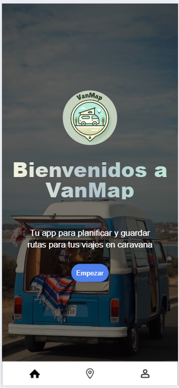

# VanMap
Sprint 9. Route calculator.

## Introduction
VanMap is a web application for calculating caravan travel routes. Allows users to create custom routes with origin, destination and intermediate stops, as well as save favorite routes and locations in their profile.




## Features
- **Firebase Authentication**: Register and log in securely.
- **Route calculation**: Find routes between origin and destination, with the option of adding intermediate stops.
- **Location management**: ​​Save your favorite routes and locations to your profile.
- **Modern and fast frontend**: Developed with React + Vite, styled with TailwindCSS.
- **Efficient API consumption**: Axios for request management and Firestore as a real-time database.
- **Smooth navigation**: React Router DOM for a dynamic user experience.

## Requirements
To run this project, make sure you have the following tools installed:
- Node.js (version 14 or higher)
- npm (version 6 or higher)
- React (compatible versions with the code)
- React Router DOM (v6 or higher)
- Tailwind CSS (version 2 or higher)
- Firebase and Firestore (for authentication and data storage)
- Access to the Mapbox API (for route visualization and calculation)
- Modern browser (Google Chrome, Firefox, etc.)

## Technologies Used
- **React + Vite**
- **Tailwind CSS**
- **React Router**
- **Axios**
- **Mapbox**

## Instructions
### 1. Clone the repository
First, clone the repository to your local machine:
```bash
git clone https://github.com/Naomigarcia99/VanMap.git
cd VanMap
```

### 2. Install dependencies
```bash
  npm install
```

### 3. Configure Mapbox, Firebase, Firestore and Environment Variables
1. Create an account on Mapbox:
  - Go to Mapbox and click "Sign Up" to create a free account if you don't already have one.

2. Create a new access token (Access Token):
  - In the Mapbox dashboard, go to the "Tokens" section (it may be in "Account" > "Access Tokens"). Click "Create a token" to generate a new token.
  - Once the token is created, copy it. This is the Access Token that you will have to put in .env

3. Create a project in Firebase:
  - Go to the Firebase console and click "Add Project" and follow the instructions to   create a new Firebase project.

4. Configure Firestore:
  - In the left menu, click "Firestore Database" then click "Create Database." and choose the startup mode (you can select “Start in trial mode” to get started quickly).

5. Configure security rules in Firestore:
  - In the Firestore dashboard, click the "Rules" tab. Copy and paste the following rules into the rules editor to ensure that only authenticated users have access to the data:
```bash
service cloud.firestore {
  match /databases/{database}/documents {
    match /routes/{routeId} {
      allow read, write: if request.auth != null;
    }
      match /favorites/{favoriteId} {
      allow read, write: if request.auth != null;
    }
  }
}
```
 - Click "Publish" to save the rules.

6. Get Firebase credentials:
  - In the main Firebase dashboard, click "Project Settings" (gear icon at the bottom left). Go to the "Application Settings" tab and select "Web." Copy the code that appears in the "FirebaseConfig" field.

7. Create an .env file in the project root and add your Mapbox token and your Firebase credentials:
```bash
VITE_MAPBOX_ACCESS_TOKEN=your-mapbox-token
VITE_API_KEY=your-api-key
VITE_AUTH_DOMAIN=your-auth-domain
VITE_PROJECT_ID=your-project-id
VITE_STORAGE_BUCKET=your-storage-bucket
VITE_MESSAGING_SENDER_ID=your-messaging-sender-id
VITE_APP_ID=your-app-id
```

- ### 4. Run the aplication

To start the application, use the following command:
```bash
 npm run dev
```
